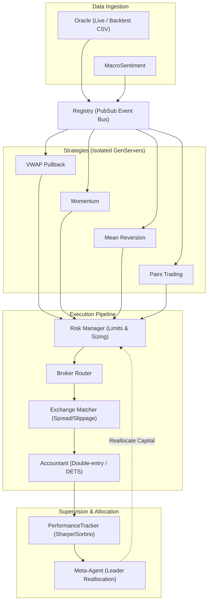

# Trading Swarm

A novel event-driven multi-agent algorithmic trading engine in Elixir exploring BEAM OTP concurrency, actor isolation, and dynamic capital allocation.

## Architecture



## System Design

- **Fault Isolation:** Each strategy runs as an isolated `GenServer` under a `DynamicSupervisor`. If a strategy crashes on an edge-case calculation, its supervisor restarts it without affecting open orders, the execution pipeline, or other running agents.
- **Decoupled PubSub:** Market ticks and sentiment updates broadcast over a local `Registry` PubSub. Producers and consumers have zero direct compile-time coupling.
- **Execution Pipeline:** Orders pass sequentially through pre-trade risk checks (drawdown limits, concentration caps, ATR sizing), simulated exchange matching (dynamic spread, volume impact, tick delay), and an append-only double-entry ledger backed by DETS.
- **Adaptive Allocation (Meta-Agent):** Runs strategies in parallel paper accounts while `PerformanceTracker` monitors rolling Sharpe and Sortino ratios. When a strategy outperforms the current leader by >= 0.3 Sharpe, the Meta-Agent reallocates primary execution capital to mirror the leader.

> **Note on Strategy Code:** The quant-specific code in `lib/trading_swarm/agents/quant_*.ex` was generated by an LLM and tested by me. It is not a key focus of this project, so it is sufficient as it is. Its role is to provide representative workloads and competing signal streams; the core focus of this project is the OTP architecture, process isolation, and the risk/capital allocation pipeline.

## Quickstart

### Prerequisites
- Elixir 1.14+ / Erlang/OTP 25+

```bash
git clone https://github.com/your-username/trading_swarm.git
cd trading_swarm
mix deps.get
```

### Running Tests
```bash
mix test
```

### Running the Backtest Engine
Runs the swarm against the bundled historical minute data (`data/historical.csv`):

```bash
# Linux / macOS
MODE=backtest iex -S mix

# Windows (PowerShell)
$env:MODE="backtest"; iex -S mix
```

## Project Structure

| Module | Role |
|---|---|
| `TradingSwarm.Agents.Oracle` | Ingests live ticks or streams historical CSV data |
| `TradingSwarm.Agents.RiskManager` | Position sizing, exposure limits, circuit breakers |
| `TradingSwarm.Agents.ExchangeMatcher` | Fills simulation with dynamic spread & volume impact |
| `TradingSwarm.Agents.Accountant` | Double-entry ledger, PnL, cash/margin tracking (DETS) |
| `TradingSwarm.Agents.MetaAgent` | Capital allocator switching between competing quants |
| `TradingSwarm.PerformanceTracker` | Rolling Sharpe/Sortino and drawdown calculator |
| `TradingSwarm.KnowledgeBase` | Shared state & fact store backed by DETS |

## License
This project is licensed under the MIT License - see the [LICENSE](LICENSE) file for details.
